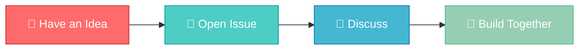

<div align="center">

# 💡 Open Source Idea Incubator

### 🚀 Where Great Ideas Become Amazing Projects 🚀

[](../../issues)
[](../../stargazers)
[](../../network/members)
[](LICENSE)


**A collaborative space where developers, designers, and innovators share and discuss ideas for new open source projects**

[Submit an Idea](../../issues/new) • [Browse Ideas](../../issues) • [Join Discussion](../../discussions)

</div>

---

## 🎯 Purpose

<table>
<tr>
<td width="25%" align="center">

<br><b>Brainstorm</b>
<br>Share innovative ideas
</td>
<td width="25%" align="center">

<br><b>Collaborate</b>
<br>Connect with others
</td>
<td width="25%" align="center">

<br><b>Build</b>
<br>Turn ideas into reality
</td>
<td width="25%" align="center">

<br><b>Launch</b>
<br>Create impact
</td>
</tr>
</table>

---

## 🚀 How to Submit Your Idea

> **Got a brilliant idea?** Share it with the community in 4 easy steps!



### 📋 Step-by-Step Guide

1. **🔍 Go to the [Issues](../../issues) tab**
2. **➕ Click "New Issue"**
3. **✍️ Describe your idea** with details:
   - 🎯 What problem does it solve?
   - 👥 Who is the target audience?
   - 🛠️ What technologies might be involved?
   - 💡 Any initial thoughts on implementation?
4. **🎉 Submit** and engage with the community!

---

## 💬 Discussion Process

<div align="center">

```diff
+ Submit your idea in Issues
+ Community members engage and discuss
+ Explore different approaches together
+ Evaluate technical feasibility
+ Find potential collaborators
+ Evolve the idea through collective input
```

</div>

---

## 🤝 Contributing

<div align="center">

| 🎨 Everyone is Welcome! |
|:---:|

</div>

- ✨ **Submit** new project ideas
- 💭 **Comment** on existing ideas
- 🔍 **Help refine** and improve proposals
- 🛠️ **Volunteer** to help build promising projects
- ⭐ **Star** this repo to show support
- 🔔 **Watch** to stay updated on new ideas

---

## 📋 Idea Submission Template

When submitting an idea, consider including:

| Field | Description |
|-------|-------------|
| 🏷️ **Title** | A clear, concise name for your project |
| ❓ **Problem Statement** | What issue are you trying to solve? |
| 💡 **Proposed Solution** | Your vision for addressing the problem |
| 👥 **Target Users** | Who would benefit from this project? |
| 🔧 **Tech Stack** | Technologies to use (optional) |
| 🌐 **Inspiration** | Similar projects or references (if any) |

---

## 🌟 From Idea to Reality

<div align="center">

### The Journey of an Idea 🗺️

**Idea Submission** → **Community Discussion** → **Team Formation** → **Project Launch** → **Impact! 🎉**

</div>

The best ideas discussed here may:

- 🎓 Graduate into their own repositories
- 👥 Attract a team of contributors
- 📚 Receive guidance on project setup and structure
- 🤗 Get support throughout the development process

---

## 📜 License

> 💡 **Ideas are meant to be shared!**

Ideas shared in this repository are open for anyone to implement. If you decide to build a project based on an idea from here, please:
- 🙏 Acknowledge the original contributor
- 🤝 Consider inviting them to collaborate
- 💬 Share your progress back with the community

---

## 🔗 Get Started

<div align="center">

### Ready to share your idea? 🎯

[](../../issues/new)
[](../../issues)

<br>


### **Let's build something amazing together! 🚀**

<sub>Made with ❤️ by the open source community</sub>

</div>

